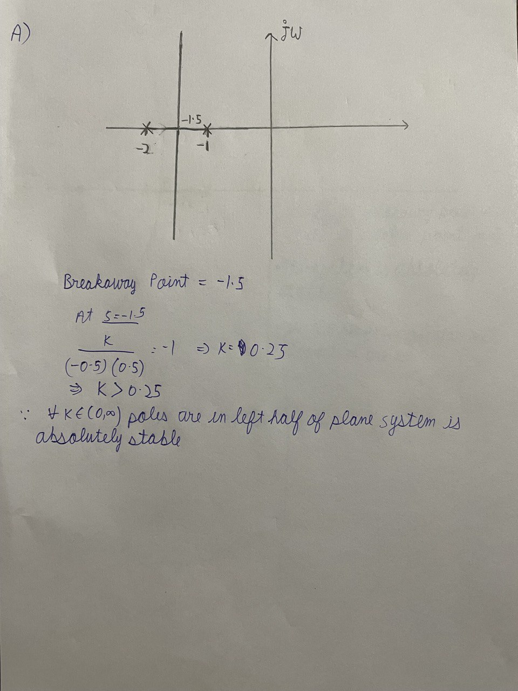
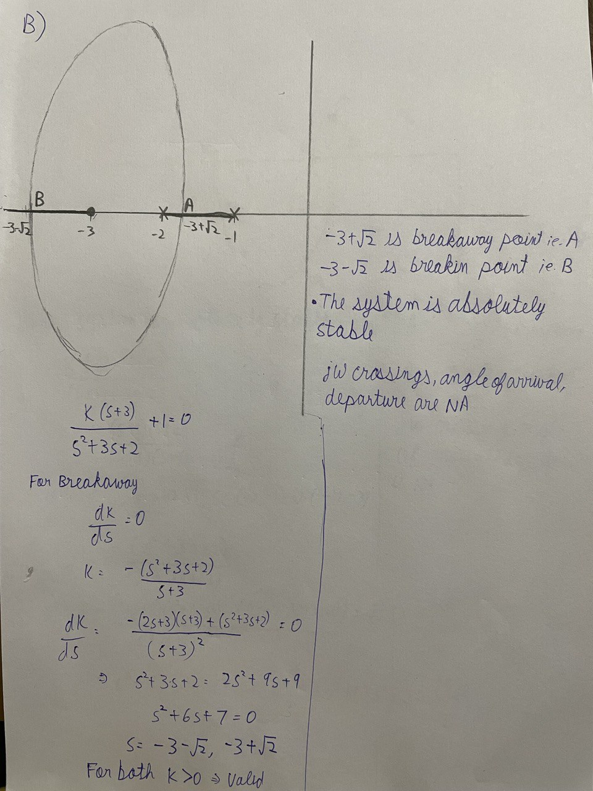
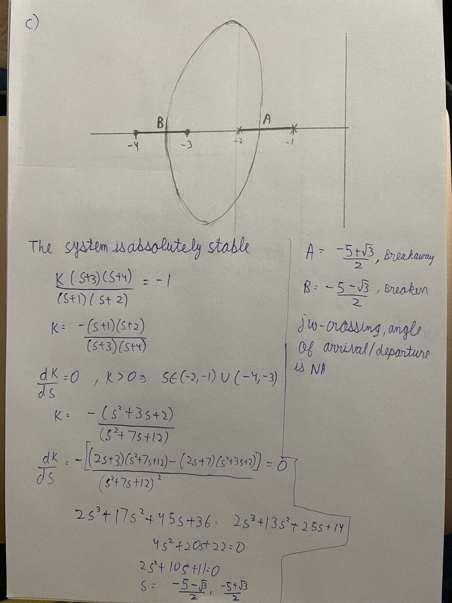
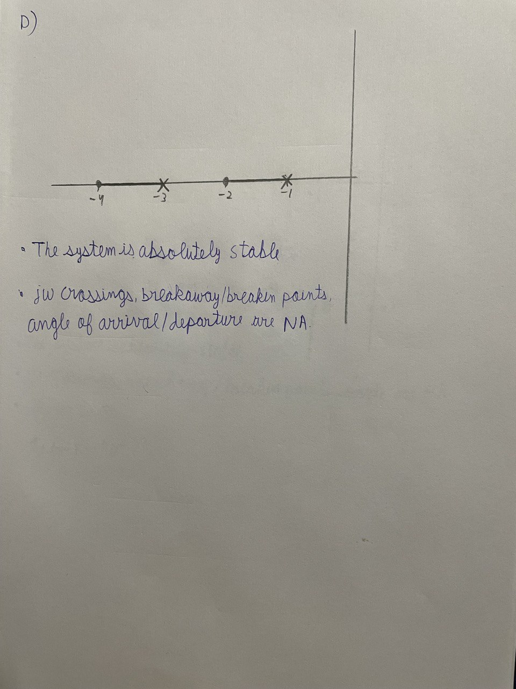
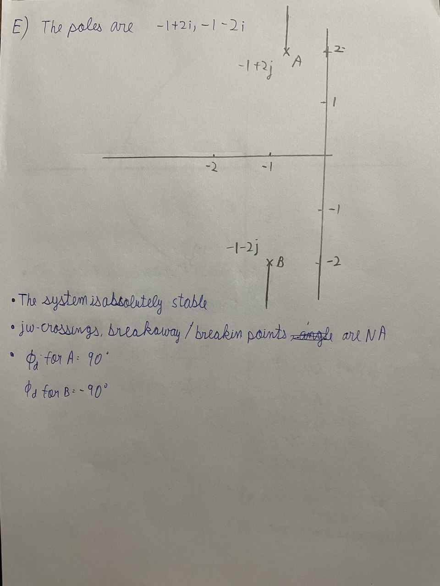
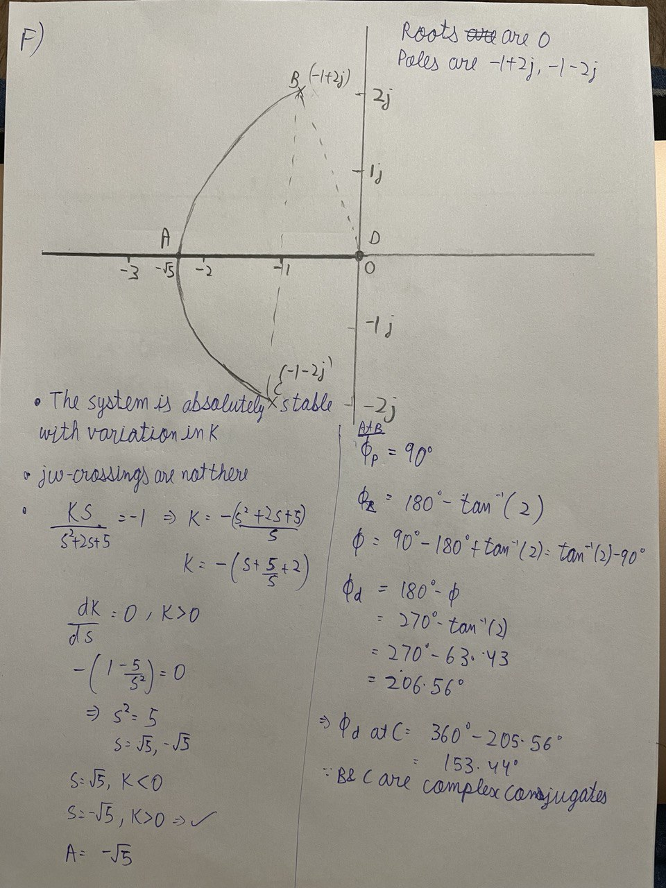
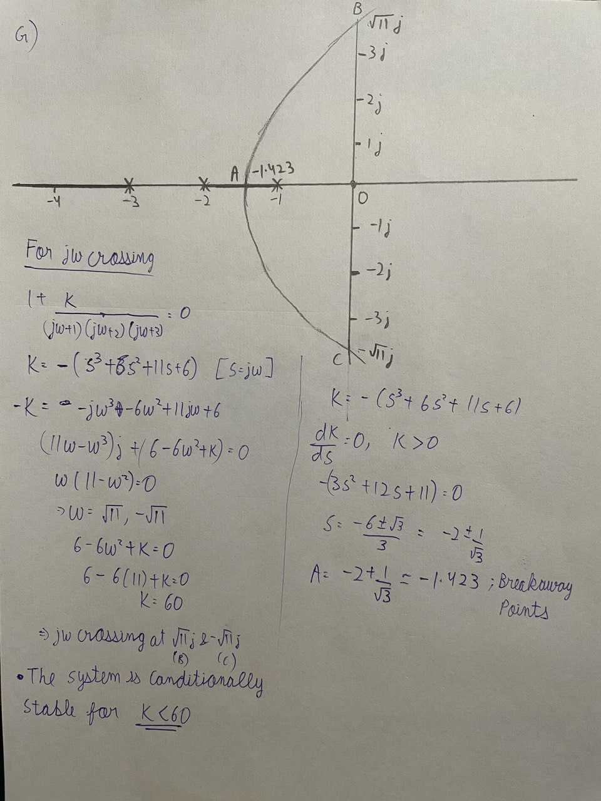

### Overview

We read about the rules of locus formation.

To calculate breakin/breakout points we need to find all those $s$ and $K$ for $1 + KG(s)H(s)$ where $\frac{dK}{ds} = 0$ and $K > 0$

To calculate $j\omega$ crossings we input $s$ as $j\omega$ and find the roots for the real and imaginary parts from which we get $k$ and $w$

To calculate angles we look at complex conjugate open loop poles and complex conjugate open loop zeros.

The complete solution write-up is as follows:















We can also verify the validity of the sketches with this python code:

```py
from matplotlib import pyplot as plt
import control

s = control.TransferFunction.s
# Write the value of G(s)H(s)
G = 1/((s+1)*(s+2)*(s+3))
rlist, klist = control.rlocus(G)
plt.show()
```

#### Credits
The solution to this problem is courtesy of Sankalp Mittal.
